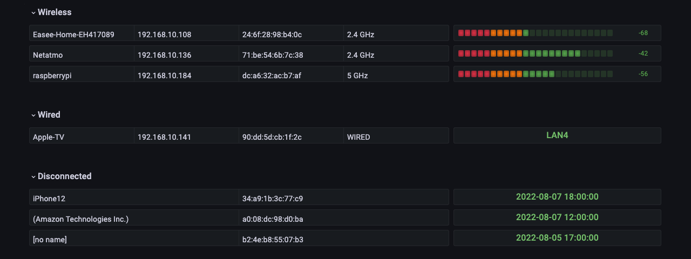

# Prometheus exporter for Altibox networks

Monitor devices on your Altibox network.



## Description

This prometheus exporter will connect to the Altibox website, get information on devices connected to your network and make them available for Prometheus.  
See the provided [Grafana dashboard](grafana/dashboard.json) for examples on how the data can be used.

## Running

Docker image is available on [ghcr.io](https://github.com/terjesannum/altibox-network-exporter/pkgs/container/altibox-network-exporter).

```sh
docker run -d -p 8080:8080 --restart always -e ALTIBOX_USER=... -e ALTIBOX_PASSWORD=... ghcr.io/terjesannum/altibox-network-exporter:5
```

*Note: Altibox seems to only support one active user session, so don't run multiple instances of this exporter.*

## Metrics

```
# HELP altibox_network_client Connection status of network client
# TYPE altibox_network_client gauge
altibox_network_client{connected_to="",connection="DISCONNECTED",ip="192.168.1.142",mac="a0:02:dc:29:f1:ba",manufacturer="Amazon Technologies Inc.",name="",port=""} 0
altibox_network_client{connected_to="VMG8825-B50B (54:83:3a:80:6e:a5)",connection="WIFI24GHZ",ip="192.168.1.108",mac="24:6f:28:98:b4:0c",manufacturer="",name="Easee-Home-EH417089",port=""} 1
altibox_network_client{connected_to="VMG8825-B50B (54:83:3a:80:6e:a5)",connection="WIFI5GHZ",ip="192.168.1.184",mac="dc:a6:32:ca:7b:a3",manufacturer="",name="raspberrypi",port=""} 1
altibox_network_client{connected_to="VMG8825-B50B (54:83:3a:80:6e:a5)",connection="WIRED",ip="192.168.1.141",mac="90:dd:5d:cb:1f:2c",manufacturer="",name="Apple-TV",port="LAN4"} 1
```

```
# HELP altibox_network_client_wifi_rssi Signal strength of connected wifi client
# TYPE altibox_network_client_wifi_rssi gauge
altibox_network_client_wifi_rssi{connected_to="VMG8825-B50B (54:83:3a:80:6e:a5)",connection="WIFI24GHZ",ip="192.168.1.108",mac="24:6f:28:98:b4:0c",manufacturer="",name="Easee-Home-EH417089"} 64
altibox_network_client_wifi_rssi{connected_to="VMG8825-B50B (54:83:3a:80:6e:a5)",connection="WIFI5GHZ",ip="192.168.1.184",mac="dc:a6:32:ca:7b:a3",manufacturer="",name="raspberrypi"} 40
```

## Prometheus

As metrics are collected on demand from Altibox' servers, don't scrape the exporter too often and tolerate slow response. Example scrape config:

```yaml
- job_name: altibox-network-exporter
  scrape_interval: 1m
  scrape_timeout: 50s
  static_configs:
    - targets: ['localhost:8080']
```
